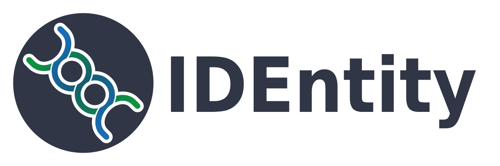

# "Many programmers, one IDEntity."

### IDEntity is a development environment with features for pair programmers and teams focused on collaboration. Enabled with remote connection and documentation features, programmers have the features they need to collaborate effectively. IDEntity includes seamless real-time code sharing, synchronized editing, and built-in documentation tools, in one desktop app. IDEntity ensures that pairs and teams stay connected, documented, and most importantly, unified under one identity. Ready to change the experience of writing, reviewing, and maintaining code together?

### Current Usage - Development

**First time setup:**
```
git clone https://github.com/tmedina23/IDEntity.git
npm install
```
Install [Visual Studio Build Tools](https://visualstudio.microsoft.com/visual-cpp-build-tools/) with the **"Desktop development with C++"** workload, then add the **"MSVC v143 - VS 2022 C++ x64/x86 Spectre-mitigated libs"** individual component. Then run:
```
npx electron-rebuild -f -w node-pty
```

**Every time after that:**
```
npm run build
npm run execute
```